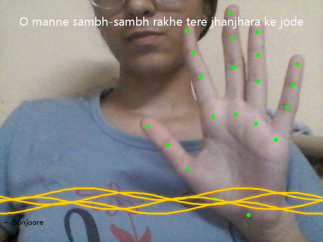

# 🎵 AirSymphony

AirSymphony is an AI-powered hand gesture controlled music player built using Python.

## Features

- ✋ Two-hand gesture control
- 🎵 Play and pause music using hand gestures
- 🎧 Change songs using finger gestures
- 📝 Real-time synced lyrics
- 🌊 Animated visual wave effects
- 📷 Real-time hand tracking

## Technologies Used

- Python
- OpenCV
- MediaPipe
- Pygame
- Computer Vision

## How to Run

Install required libraries:

Run the application:

## Demo

Demo video will be added soon.